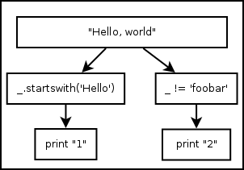
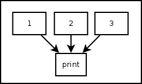

.. _tut-ctrlflowtools:

******************
Control Flow Tools
******************

Pythonect supports standard control flow tools, but with a twist!

.. _tut-if:

Using Boolean Values as ``if`` Statement
========================================

There's no ``if`` keyword in Pythonect, instead, boolean values are used to
determine whether to terminate or continue the flow.

.. _tut-if-true:

:const:`True` as Pass-through
-----------------------------

Whenever a Python expression or function returns :const:`True` the current
value in the flow is pushed to the next operation. For example:   
::

    1 -> [_ < 2] -> print

Will print :const:`1`, because the expression is evaluated to :const:`True` (i.e. 1 <
2). Another example:   
::
    
    "Hello, world" -> _.startswith('Hello') -> print

Will print ``"Hello, world"`` because ``startswith`` method returned :const:`True`
(i.e. "Hello, world" string starts with "Hello" string). 

.. _tut-if-false:

:const:`False` as Terminator
----------------------------

Whenever a Python expression or function returns :const:`False` the current
flow terminates and returns False. For example: 
::

    "Hello, world" -> _.startswith('ello') -> print

This will not print anything and return :const:`False`.

.. _tut_multi_as_all:

Using Multithreading as ``elif`` and ``else``
---------------------------------------------

Since there's no ``if``, there's also no ``elif`` or ``else``, instead all
possible flows are evaulated at once. For example: 
::

    "Hello, world" -> [[_.startswith('Hello') -> print "1"], [[_ != 'foobar'] -> print "2" ]]

Graphically (Visual programming wise), represented as:

Both versions will print (each in its own thread, and not necessarily in that
order): :const:`1` and :const:`2`.

.. _tut-for:

Using Iterable Object as ``for`` Statement
==========================================

There's no ``for`` keyword, instead, every Iterable object is treated as a
for-loop. For example: 
::

    [1,2,3] -> print

And
::

    (1,2,3) -> print

Both, Graphically (Visual programming wise) represented as:

Will print :const:`1`, :const:`2`, and :const:`3` (not necessarily in that
order). The same applies to generator functions (i.e. ``yield``) and Python
classes that implement __iter__() method.

The only exception are strings. Pythonect does not iterate Python strings by
default. To iterate a string in Pythonect, use Python's built-in iter()
function as follows:  
::

    iter("abc") -> print

The code above will print the letters: ``a``, ``b``, and ``c`` (not
necessarily in that order).

.. tut-dict-as-switch:

Using Dictionary as ``switch`` Statement
========================================

There's no ``switch`` keyword in Pythonect, instead, every literal ``dict``
can be used as a ``switch``-like mechanism (without fallthrough). For example:
::

    1 -> {1: 'One', 2: 'Two'} -> print

Will print ``One``. While:
::

    3 -> {1: 'One', 2: 'Two'} -> print

Will will not print and return :const:`False`

