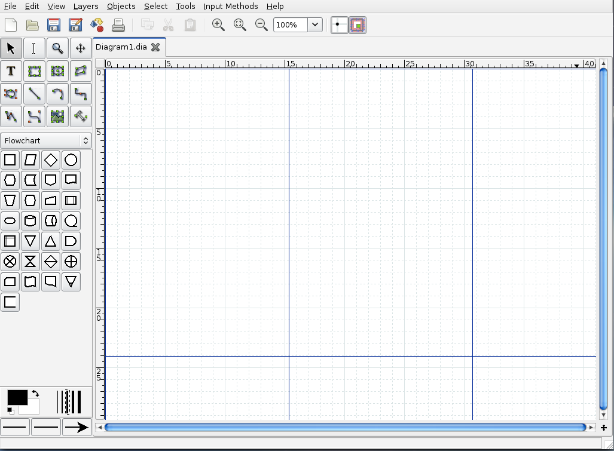
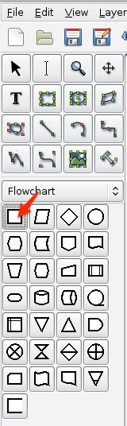
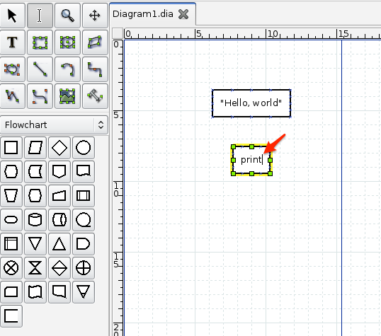
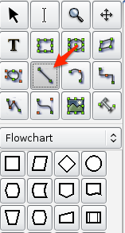
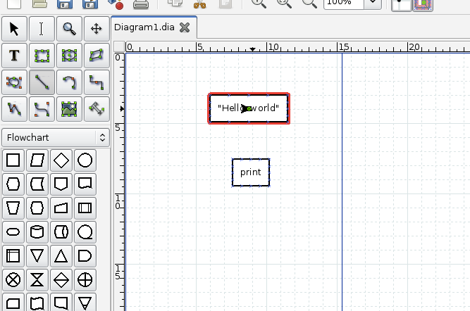
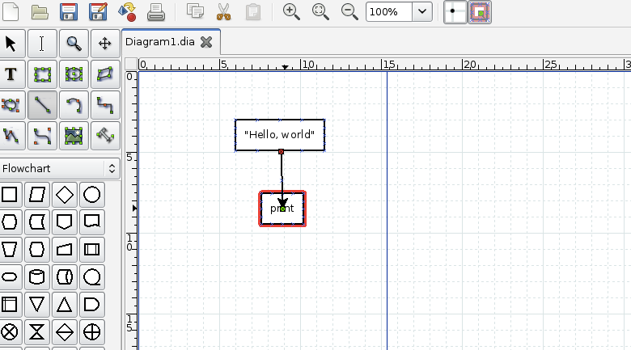
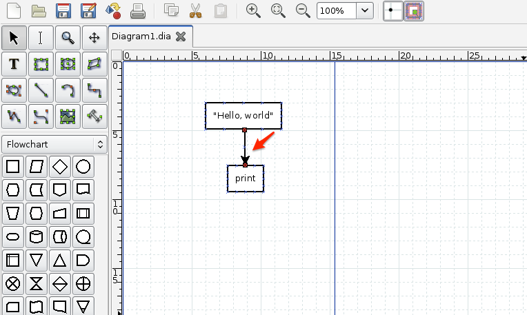

.. _tut-helloworld:

Hello World Program
===================

Pythonect provides both a visual programming language and a text-based
scripting language. 

The following is an example Hello world program in both visual and text-based
languages. Both versions consist of the same flow.

.. _tut-visualexample:

Visual Programming Version
--------------------------

Pythonect supports multiple graph describing languages and diagram formats.
For the Hello world example I will be using `Dia
<https://wiki.gnome.org/Dia/>`_.

:program:`Dia` is a free and open source general-purpose diagramming software.
For instructions on how to download and install :program:`dia`, please visit `Dia Website
<https://wiki.gnome.org/Dia/>`_

When you launch :program:`dia` you should see an empty :file:`Diagram1.dia` tab, like this:

Start by clicking on the box (aka. Process/Auxliary Operation) shape to select it:

Now, click anywhere on the grid, a box (aka. Process/Auxliary Operation) should appear. Enter the text ``"Hello, world"`` (with quotes) in it:

.. image:: ../_static/dia_step_2.png

Next, click again on the grid, another box should appear. Enter the text ``print`` (without quotes) in it:

Let's connect the two boxes together. Start by clicking on the Line image to select it:

Now, click on the ``"Hello, world"`` box (it should highlight the box in Red) and drag it to the ``print`` box:

Like this:

If successful, you should see something like this: 

To test that it's indeed connect, try dragging one of the boxes and see that the Line is following, like this:

.. image:: ../_static/dia_step_8.png

If indeed the Line is following, then it's time to save the diagram. Let's save it as :file:`HelloWorld.dia` and run it, as follows:
::

    $ pythonect HelloWorld.dia

The output should be:
::

    <MainProcess:MainThread> : Hello, world

.. tut-textexample:

Text-based Programming Version
------------------------------

Open your favorite editor and type:
::

    "Hello, world" -> print

Save it as :file:`HelloWorld.p2y` and run it as follows:
::
    $ pythonect HelloWorld.p2y

The output should be:
::

    <MainProcess:MainThread> : Hello, world

To break it down: ``"Hello, world"`` is a literal String, ``print`` is a Python function, and ``->`` is a text-based data flow operator.

You can learn more about Pythonect's Data Flow Operators at the :ref:`tut-flow` section.