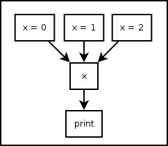
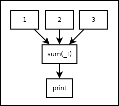

.. _tut-vars:

*********
Variables
*********

.. _tut-assignment:

Assignment Statement
====================

Pythonect supports standard Python types, but with a twist!

.. _tut-onedim-vars:

Variable ``<slug>`` in Single Thread
------------------------------------

You can define a variable and set its value as follows:
::

    [x = 0] -> x -> print

Graphically (Visual programming wise), this is represented as:

.. image:: ../_static/single_x_value.png

Both versions print :const:`0`. You can also change its value during the
program runtime as follows:    
::

    [x = 0] -> x -> print -> [x = 1] -> x -> print

This will print :const:`0` and :const:`1`, in this order, and in the same
thread. Of course you can assign and re-assign any legal Python value, for
example:   
::

    [x = 0] -> x -> print -> [x = "Hello, world"] -> x -> print

Will print :const:`0`, and :const:`"Hello, world"`

.. _tut-multidim-vars:

Variable ``<slug>`` in Multithreading
-------------------------------------

You can define a variable and set it with multiple values at the same time
(each value ``map()``\ 'ed to a different thread) as follows:   
::

    [x = 0, x = 1, x = 2] -> x -> print

Graphically (Visual programming wise), this is represented as:

Both versions will print, each in its own thread, and not necessarily in that
order: :const:`0`, :const:`1`, :const:`2`.

Of course you can assign any combinations of Python value and types, for
example:    
::

    [x = 1, x = 1, x = 0.34, x = "Hello, world"] -> x -> print

This will print, each in its own thread, and not necessarily in that order:
:const:`1`, :const:`1`, :const:`0.34`, and :const:`"Hello world"`.

Predefined Variables
====================

Pythonect predefines two variables: ``_`` and ``_!``

.. _tut-curvalue:

``_`` as Current Value
----------------------

The variable underscore (i.e. ``_``) is predefined to be the current value on
the flow, for example: 
::

    1 -> _ + 1 -> print

Will print :const:`2`. As ``_`` will be equal :const:`1` after evaluating the
:const:`1` expression. Another example is:  
::

    ["To be", "Not to be"] -> print "To be, or not to be? " + _

This will print, each in its own thread, and not necessarily in that order:
``To be, or not to be? To be`` and ``To be, or not to be? Not to be``

.. _tut-allcurvalues:

``_!`` as All Current Values
----------------------------

The variable underscore question mark (i.e. ``_!``) is predefined to be the
list of all the current values in the program (i.e. ``reduce()``'ed), for
example: 
::

    [1,2,3] -> sum(_!) -> print

Graphically (Visual programming wise), this is represented as:

Both versions will print :const:`6`. Notice how ``sum`` became a *reduce*-like
function, when it accepted a list of :const:`1`, :const:`2`, :const:`3` and
returned :const:`6`. Another example:     
::

    "Hello, world" -> reversed -> reduce(lambda x,y: x+y, _!) -> print

This will print ``"dlrow ,olleH"`` (i.e. ``"Hello, world"`` reversed)